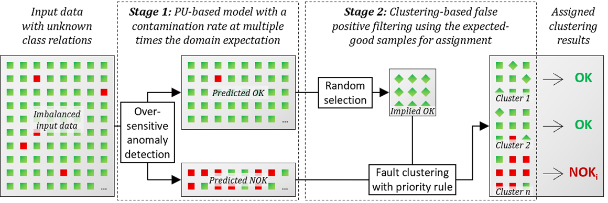

# Label-Free Fault Detection in Screw Driving

[](https://www.python.org/downloads/)
[](LICENSE)

> **Two-stage unsupervised framework achieving 82.3% F1-score without labeled training data**

Implementation of the methodology presented in:

**Label-Free Monitoring of Screw Driving using Anomaly Detection and Fault Clustering**  
*Nikolai West, Jochen Deuse*  
CIRP Annals - Manufacturing Technology, 2026

---

## Overview

Industrial screw driving quality control typically requires labeled fault examples for each process variant—a costly and time-consuming barrier. This framework eliminates that requirement through a two-stage approach that detects and categorizes faults **without labeled training data**.



### How It Works

1. **Stage 1: Over-sensitive Anomaly Detection**  
   - Deliberately flags more anomalies than expected (96% recall)
   - Accepts elevated false positive rate for later filtering
   - Uses K-Nearest Neighbors with contamination=0.03

2. **Stage 2: Clustering-Based False Positive Filtering**  
   - Clusters flagged anomalies with OK reference samples
   - Applies binary purity rule: clusters with references = false positives
   - Restores precision to 89% while maintaining 77% recall

### Performance

Validated on 1,457 industrial screw driving operations across 5 fault classes:

| Metric | Stage 1 | Stage 2 | Supervised Baseline |
|--------|---------|---------|---------------------|
| **Precision** | 43.7% | **89.4%** | 86.6% |
| **Recall** | 96.0% | **77.1%** | 88.7% |
| **F1-Score** | 60.1% | **82.3%** | 86.6% |

**Trade-off**: 4-6 percentage points lower F1 vs. supervised methods in exchange for:
- ✅ Zero label requirements
- ✅ Unknown fault detection capability  
- ✅ No retraining across process variants

---

## Quick Start

### Installation

```bash
# Clone repository
git clone https://github.com/nikolaiwest/2026-fault-detection-cirp.git
cd 2026-fault-detection-cirp

# Install dependencies (requires Python 3.11+)
pip install -e .
```

### Run Pipeline

```bash
python main.py
```

This executes the complete two-stage pipeline using the configuration in `configs/default-top5.yml`:
- Loads PyScrew S04 dataset
- Runs 5-fold cross-validation
- Outputs results to timestamped directory in `results/`

---

## Repository Structure

```
├── src/
│   ├── data/              # Data loading & preprocessing
│   ├── models/
│   │   ├── stage_1/       # Anomaly detection models (PyOD)
│   │   └── stage_2/       # Clustering models (sktime/sklearn)
│   ├── methodology/       # Two-stage pipeline orchestration
│   └── utils/             # Logging, result management
├── configs/               # YAML/TOML configuration files
├── tests/                 # Unit tests
└── main.py                # Entry point
```

---

## Configuration

Edit `configs/default-top5.yml` to customize:

```yaml
stage1:
  model_name: "k_nearest_neighbors"
  contamination: 0.03      # 3× expected fault rate

stage2:
  model_name: "sktime_kmeans"
  metric: "erp"            # Edit Distance with Real Penalty
  n_clusters: 10
  target_ok_to_sample: 50  # Reference samples for validation
  ok_reference_threshold: 0  # Binary purity rule
```

### Available Models

**Stage 1 (Anomaly Detection)**:  
`k_nearest_neighbors`, `isolation_forest`, `local_outlier_factor`, `auto_encoder`, `ecod`, `hbos`, `one_class_svm`

**Stage 2 (Clustering)**:  
`sktime_kmeans`, `sktime_kmedoids`, `sktime_dbscan`, `sktime_kshapes`, `sklearn_kmeans`, `sklearn_dbscan`, `sklearn_birch`, `sklearn_agglomerative`

---

## Results

Results are automatically saved to timestamped directories:

```
results/20260109_143022__default-top5/
├── metadata.json              # Configuration & dataset info
├── stage1/
│   └── fold_*/
│       ├── predictions.csv    # Per-sample predictions
│       ├── metrics.json       # Precision, recall, F1
│       └── confusion_matrix.png
├── stage2/
│   └── fold_*/
│       ├── predictions.csv
│       ├── metrics.json
│       ├── cluster_composition.csv
│       └── confusion_matrix.png
└── aggregated/
    ├── summary.json           # Aggregated metrics
    ├── metrics_by_fold.csv
    └── performance_plots.png
```

---

## Dataset

Uses [PyScrew S04](https://github.com/nikolaiwest/pyscrew) dataset:
- 1,457 industrial screw driving operations
- Torque measurements at 833.33 Hz
- 5 fault classes + normal operations
- Public, reproducible benchmark

---

## Citation

```bibtex
@article{west2026labelfree,
  title={Label-Free Monitoring of Screw Driving using Anomaly Detection and Fault Clustering},
  author={West, Nikolai and Deuse, Jochen},
  journal={CIRP Annals - Manufacturing Technology},
  year={2026},
  publisher={Elsevier}
}
```

---

## License

MIT License - see [LICENSE](LICENSE) file for details.

---

## Contact

**Nikolai West**  
Institute for Production Systems (IPS)  
Technical University Dortmund  
📧 nikolai.west@tu-dortmund.de